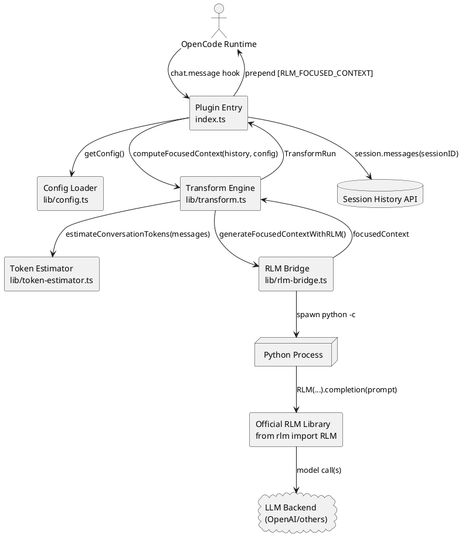
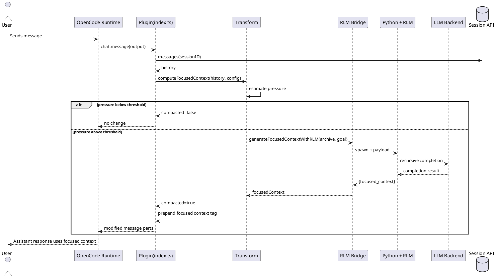

# RLM Plugin Architecture (UML)

This document captures the runtime architecture of the OpenCode RLM plugin and the message-time interaction path.

## Component Diagram

## Sequence Diagram

## Module Responsibilities

- `index.ts`: hook integration, session fetch, and focused-context insertion into outgoing user text.
- `lib/config.ts`: environment-driven runtime policy and bridge settings.
- `lib/transform.ts`: pressure gating, archive extraction, goal detection, bridge orchestration.
- `lib/rlm-bridge.ts`: subprocess bridge to official Python RLM package and response validation.
- `lib/token-estimator.ts`: lightweight token approximation used for pressure detection.
