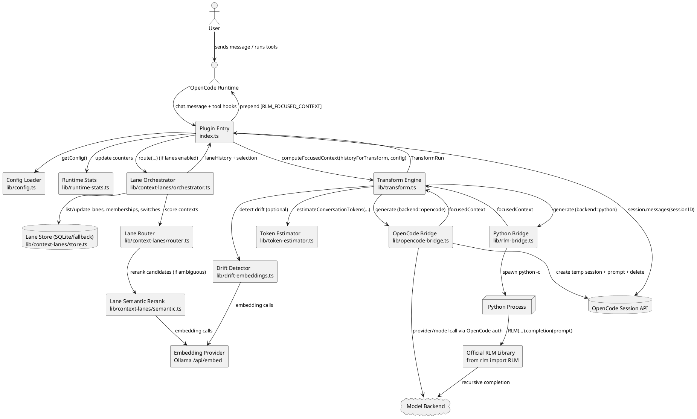
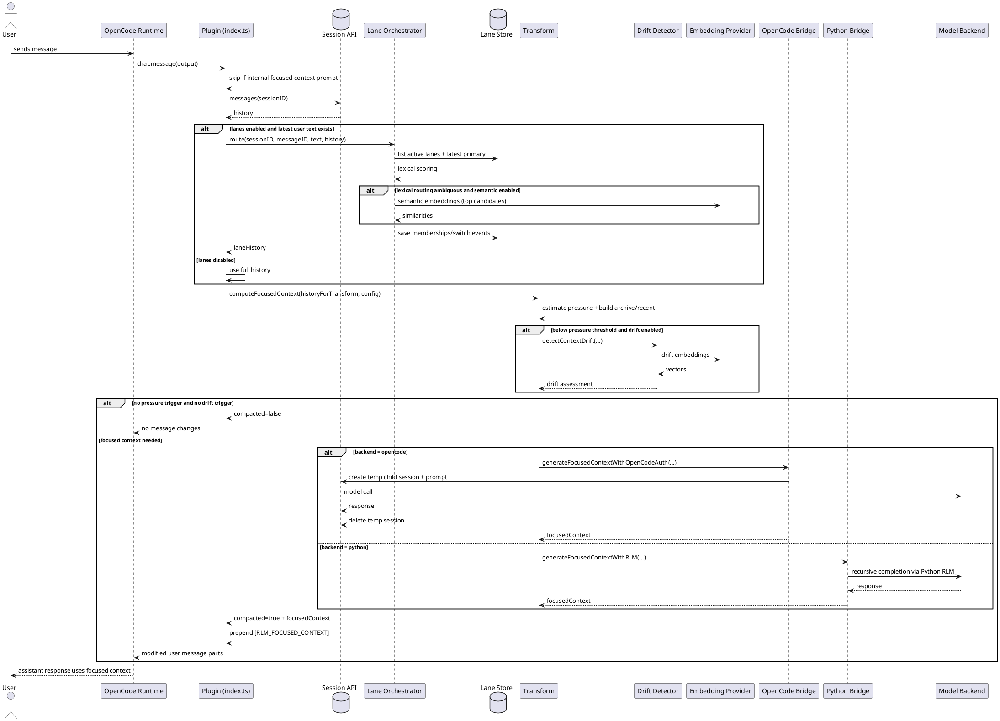

# RLM Plugin Architecture (UML)

This document describes the current runtime architecture of the OpenCode RLM plugin, including lane-aware routing, drift-triggered compaction, and dual focused-context generation backends.

## Component Diagram

## Sequence Diagram

## Module Responsibilities

- `index.ts`: plugin hooks, lane tools, session fetch, lane routing, focused-context insertion, and runtime stats updates.
- `lib/config.ts`: environment-driven runtime policy for thresholds, lanes, drift, and backend selection.
- `lib/transform.ts`: pressure/drift gating, archive extraction, recursion tier selection, and focused-context generation orchestration.
- `lib/opencode-bridge.ts`: OpenCode-authenticated focused-context generation via temporary child sessions.
- `lib/rlm-bridge.ts`: Python subprocess bridge to official `rlm` package for recursive generation.
- `lib/context-lanes/*`: lane routing (`router.ts`), semantic rerank (`semantic.ts`), orchestration (`orchestrator.ts`), and persistence (`store.ts`).
- `lib/drift-embeddings.ts`: embedding-based semantic drift detection for compaction triggers.
- `lib/runtime-stats.ts`: per-session runtime counters and formatted observability output.
- `lib/token-estimator.ts`: lightweight token approximation used in pressure estimation.
