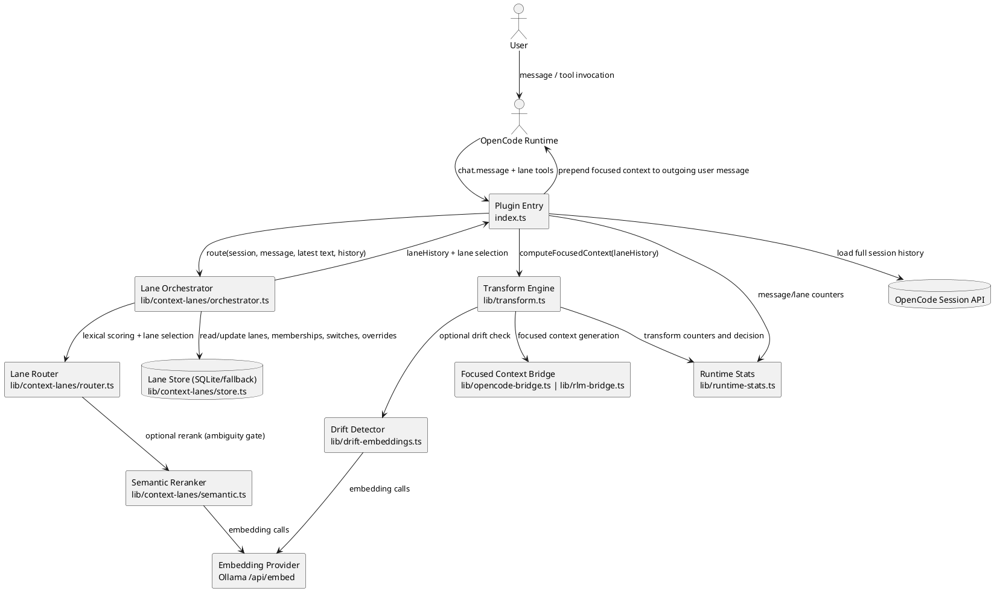
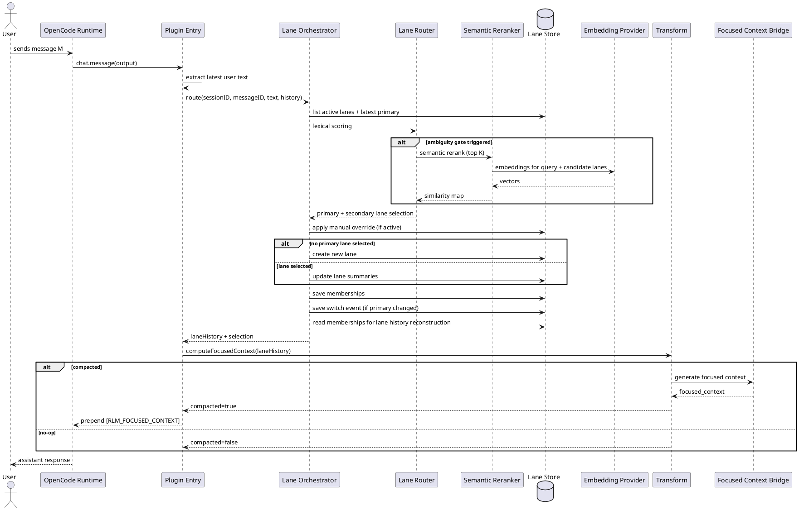
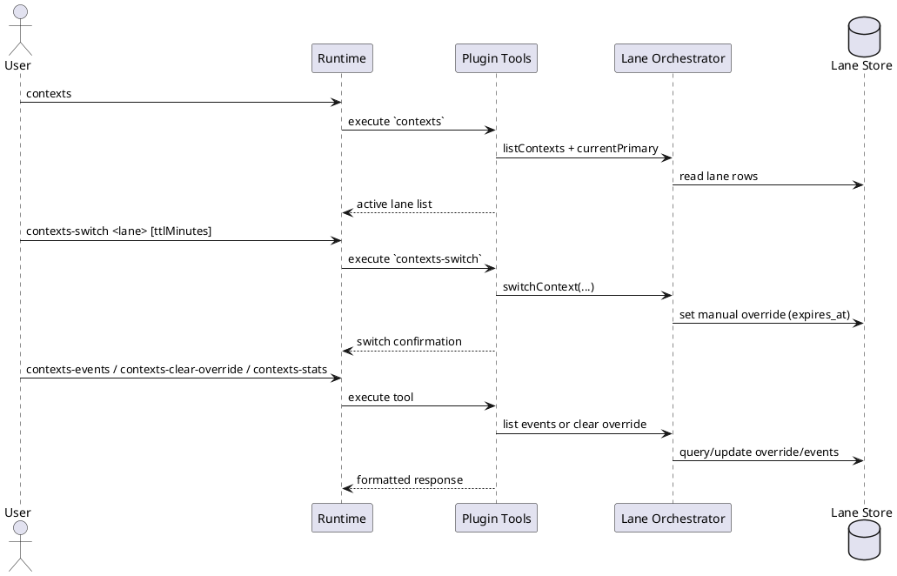
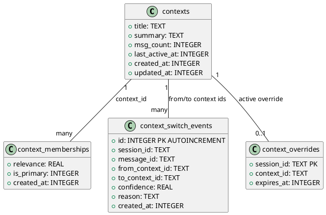
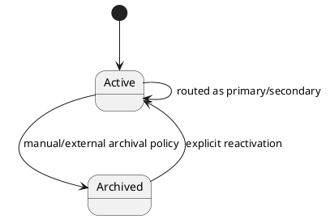

# Multi-Context Lane Architecture (UML)

This document describes the current lane-routing architecture used by OpenCode RLM.
It reflects the implemented flow in `index.ts` and `lib/context-lanes/*`, including semantic reranking and lane utility tools.

## Goals

- Route each incoming message to the most relevant active lane while preserving continuity.
- Keep transform input bounded by selecting lane-relevant history plus recent tail safety context.
- Track lane assignments, primary-lane switches, and temporary manual overrides.
- Expose lane state and controls through plugin tools.

## Component Diagram

## Message Routing Sequence

## Lane Utility Tools Sequence

## Data Model Diagram

## Lane Lifecycle (State)

## Current Implementation Notes

1. Lane store is implemented with SQLite (`node:sqlite` or `bun:sqlite`) and an in-memory fallback.
2. Routing uses lexical scoring first, with optional semantic rerank for ambiguous top candidates.
3. Lane history includes selected-lane memberships plus recent-tail safety context; it falls back to full history when too small.
4. Utility tools are implemented as `contexts`, `contexts-switch`, `contexts-clear-override`, `contexts-events`, and `contexts-stats`.
5. Archival lifecycle transitions are represented in the model, but automatic aging/archival policy is not currently enforced by the orchestrator.
