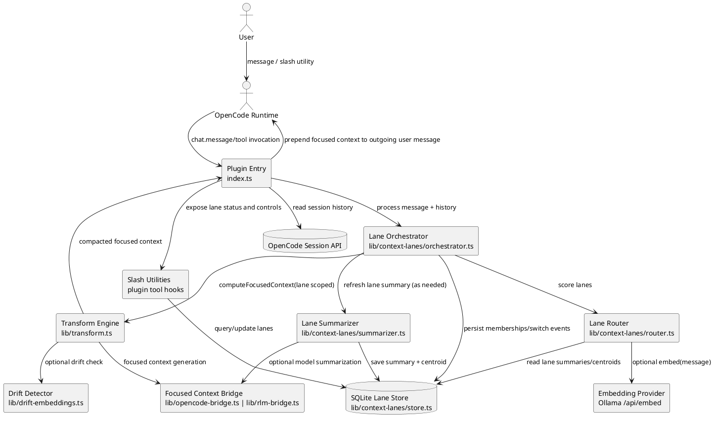
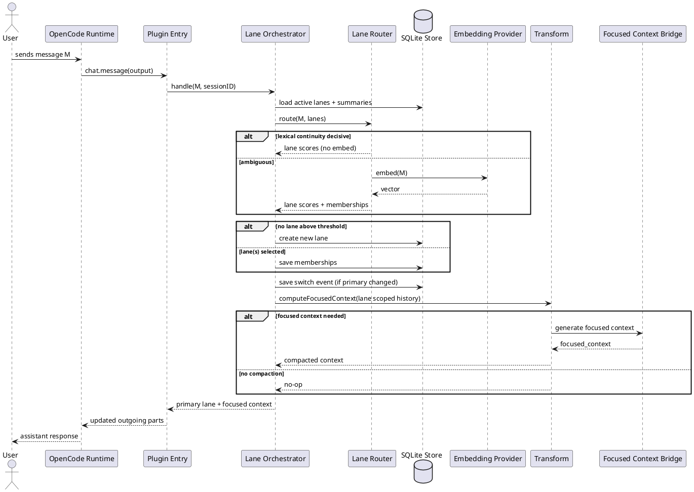
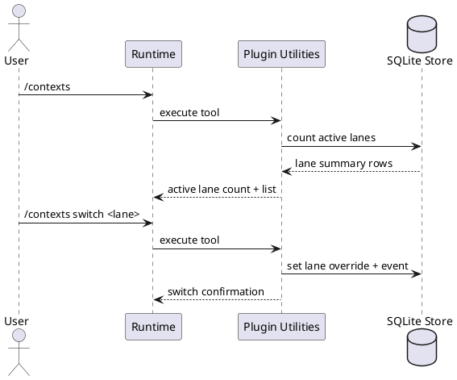
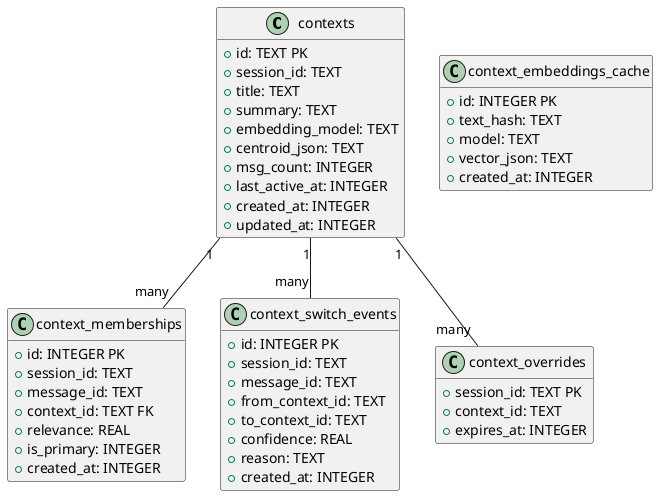
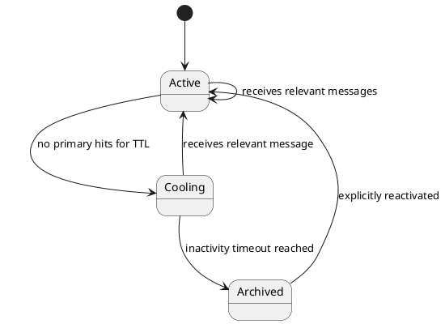

# Multi-Context Lane Architecture (UML)

This document describes a simple, modular lane-based context system for OpenCode RLM.
It focuses on data flow, routing, and observability while keeping inference overhead low.

## Goals

- Route each incoming message to one or more active context lanes.
- Keep lane context bounded and relevant before focused-context generation.
- Preserve full session history while operating on compact lane-specific working context.
- Expose lane state and switches through plugin utilities.

## Component Diagram

## Message Routing Sequence

## Slash Utility Sequence

## Data Model Diagram

## Lane Lifecycle (State)

## Implementation Order

1. Add SQLite lane store and migrations.
2. Add router service (scores, thresholds, multi-membership).
3. Add orchestrator and integrate with `chat.message` path.
4. Add utility tools (`/contexts`, `/contexts list`, `/contexts switch`, `/contexts explain`).
5. Add switch event feed for UI surface.
6. Add tests for routing, lane creation, switch hysteresis, and utility output.
